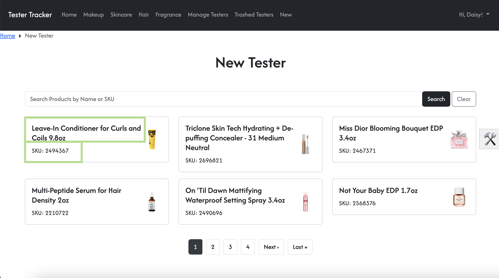
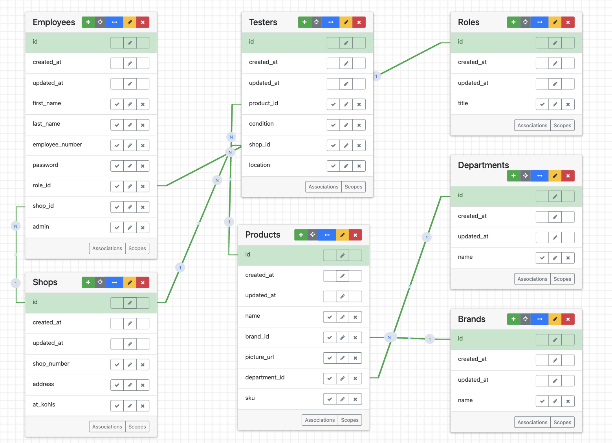

# Tester Tracker

## Description
Tester Tracker is an inventory management tool that allows Sephora team members to manage their store’s backstage product testers.

### Disclaimer
**This application is not affiliated with, endorsed by, or officially connected to Sephora in any way.** It is solely a personal project developed as a playground environment for educational and experimental purposes. The app does not represent real employees, processes, or operations at Sephora. Any references to Sephora, its roles, or its products are purely fictional and for illustrative purposes only. **If you have any concerns regarding the use of brand names or references, feel free to reach out via the contact information below.** 

## Table of Contents
- [Features](#features)
- [Installation](#installation)
- [Usage](#usage)
- [Entity Relationship Diagram](#entity-relationship-diagram)
- [Troubleshooting](#troubleshooting)
- [Contributing](#contributing)
- [Contact](#contact)

## Features
- Role-specific views for Operations Associates, Admins, Beauty Advisors, Leads, and Managers, each with access to relevant features for their responsibilities.
- Search for products by name or SKU.
- Create and manage tester inventory.
- Trash and approve testers.

## Installation

### Prerequisites
- Ruby 3.x
- Rails 7.x
- PostgreSQL

1. Clone the repository:
`git clone https://github.com/dgarcia13-99/tester-tracker-sephora`

2. Install the required gems:
`bundle install`

3. Set up the database:
`rake sample_data`

4. Start the Rails server:
`bin/dev`

## Configuration

Currently, there aren’t any specific configurations needed for this project.

If you’re looking to add things like API keys, environment settings, or other sensitive info, a good way to handle that is by using Rails credentials. It’s a secure way to keep sensitive information out of version control while still making it easy to use in your app.

## Usage

1. Start the Rails server:
`bin/dev or dev`

2. Open browser and navigate to http://localhost:3000

3. Use one of the following user profiles to interact with data-rich views or create an account and interact with the application using data seeded into your role's interface. 

  NOTE: The credentials provided are for testing purposes only and do not correspond to any real Sephora accounts or information.

- `username: 356177, password: password` : Operations interface
- `username: 100000, password: password` : Admin interface
- `username: 111111, password: password` : Lead interface
- `username: 222222, password: password` : Beauty Advisor interface
- `username: 333333, password: password` : Manager interface

4. The search functionality assumes user has knowledge of Sephora's products(e.g. product names or SKUs). Refer to the `Makeup`, `Skincare`, `Hair`, `Fragrance` views to find examples of product names or SKUs available at user's store location. 

5. Create a new tester in the `New` view. Use the products cards listed below the search bar to find a product you'd like to make a tester for.

Example of the `New` view for creating testers:

6. `Manage Testers` and `Trash Tester` views are available only for Sephora's Operations Associates and Admin. If you'd like to access these views, sign up as an Operations Associate or Admin. 

7. As an Operations Associate, you can trash testers that have been placed onstage or aren't in condition to be an onstage tester.

8. An Operations Associate can remove newly created testers that have been placed onstage from inventory by approving them.

9. Admin and Operations teammembers can keep track of tester usage by visiting the `Trashed Testers` view.

## Entity Relationship Diagram 

Visual representation of Tester Tracker's database

## Troubleshooting

### Server not starting

1. Ensure all required gems are installed: Run `bundle install` in terminal.

2. Verify Ruby version (e.g. Ruby 3.x): Run `ruby -v` in terminal. Install correct version if needed.

3. Restart the server `bin/server`.

### Images or Assets not Loading

1. Visit `app/assets/images` and verify that images are correctly saved in `images` or folder under `images`.

2. In production.rb, ensure `config.assets.compile = true` is present.

3. Restart the server `bin/server`.

### Unable to log-in

1. Run `rake sample_data` to populate database with seed data.

2. Run `rails console` and query data (e.g. `Employee.all` or `Employee.count`) to ensure it was seeded correctly.

## Contributing

Contributions are welcome! Please follow these guidelines:

1. Fork the repository
2. Create a new branch (`git checkout -b branch_name`)

  **Branch Naming Conventions:**
  Name your branch using your initials, contribution (feature or bugfix), and brief description.
  - `git checkout -b initials-feature_or_bugfix-description` (e.g. `dg-feature-add_user_authentication`)

3. Commit your changes (`git commit -m 'Add some feature'`)

  **Coding Conventions:**
  - Ensure you are not making commits directly on the main branch.
  - Make commit messages concise and descriptive. Include variables, methods, and file names that were updated.
  - When making changes, add a short one-line comment on what was changed and how it works.
  - Use snake case for your descriptive variables.
  - Use camel case for classes and modules.
  - Adhere to Ruby's coding conventions to maintain clean, readable, and consistent code. Refer to Ruby's style guide for more information.

4. Push to the branch (`git push origin feature-branch`)
5. Open a pull request

  **Pull Request Process**
  - After committing all changes to your branch, create a pull request to the main branch.
  - In your repository settings, visit the 'Collaborators' tab and add 'dgarcia13-99' as a collaborator.
  - Visit your pull request, and add 'dgarcia13-99' a reviewer. 
  - Leave any concerns or questions in the comments section of your pull request.

## Contact

Daniela Garcia - [danielagarcia13.99@gmail.com](mailto:danielagarcia13.99@gmail.com)
Project Link: [https://github.com/dgarcia13-99/tester-tracker-sephora](https://github.com/dgarcia13-99/tester-tracker-sephora)
